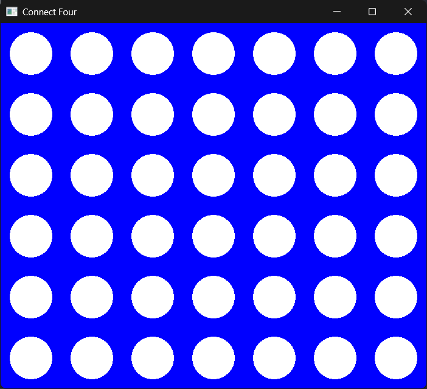
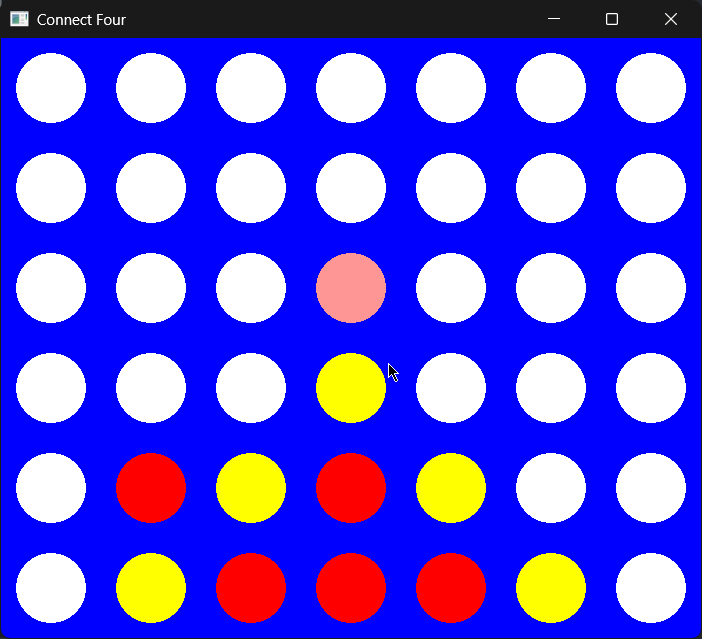
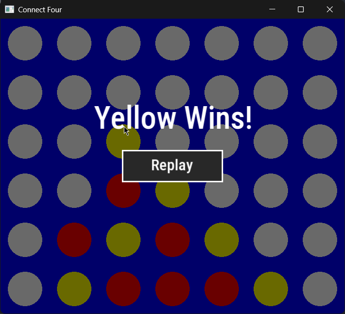

# Connect Four (C++ / SFML)

A two-player Connect Four game written in modern C++17 with [SFML 3](https://www.sfml-dev.org/) for rendering and input.

The goal of this project was to practice clean object-oriented design in C++: each class has one clear responsibility, the game rules know nothing about graphics, and state is only reachable through well-defined, `const`-correct interfaces. The game logic started as a console application and was later given a graphical front end **without changing the rules layer**, which shows the separation holding up in practice.

## Screenshots

| Empty board | Mid-game hover preview | Winner screen |
|:---:|:---:|:---:|
|  |  |  |

## Features

- Local two-player game (Red vs. Yellow) on a standard 7×6 board
- Click any column to drop a token; gravity places it in the lowest free slot
- Hover preview: a faded token in the current player's color shows exactly where a move will land
- Win detection in all four directions (horizontal, vertical, both diagonals) and draw detection
- End-of-game overlay announcing the winner, with a **Replay** button to start a new round

## Architecture

The project is built around **composition and separation of concerns**. `Game` owns a `Board` and a `Renderer` and coordinates them; neither of those two knows the other exists.

```
            ┌──────────┐
            │   Game   │   orchestration: game loop, turns, replay
            └────┬─────┘
        owns     │     owns
     ┌───────────┴───────────┐
┌────▼─────┐           ┌─────▼──────┐
│  Board   │◄── reads ─│  Renderer  │
└────┬─────┘  (const&) └────────────┘
     │ owns 7×6            SFML window, drawing, mouse input
┌────▼─────┐
│  Token   │
└──────────┘
```

| Class | Responsibility | Knows about SFML? |
|---|---|---|
| `Token` | A single cell; holds its `TokenState` (`Inactive`, `Red`, `Yellow`) | No |
| `Board` | Game rules and state: placing tokens, gravity, win/draw detection, reset | No (only uses `sf::Vector2i` as a plain 2D integer type) |
| `Renderer` | Owns the window; draws the board, hover preview and overlay; translates mouse clicks into column indices | Yes, the only class that does |
| `Game` | Owns `Board` and `Renderer`; runs the main loop, passes clicks to the board, switches turns, handles replay | No drawing, no rules |

### OOP principles applied

- **Encapsulation.** All data members are private. `Board` never exposes its internal grid; other classes ask questions through narrow accessors such as `GetTokenStateAt()`, `FindEmptyRow()` and `GetWinner()`. The internal storage was changed from a manually allocated `Token**` to `std::array` without touching `Renderer` or `Game`.
- **Single responsibility.** Rules, presentation and orchestration live in separate classes. `Renderer` reports *what the player did* (a clicked column); `Game` decides *what that means*; `Board` decides *whether it is legal*.
- **One-way dependencies.** `Renderer` receives the board as `const Board&`, so the compiler guarantees rendering can never modify game state.
- **Composition over inheritance.** Each class has exactly one role, and none is a specialisation of another, so the design deliberately uses composition (`Game` *has a* `Board` and *has a* `Renderer`) instead of an inheritance hierarchy. Adding a different front end (for example a console renderer) would mean writing another renderer, with no change to `Board`.
- **Const-correctness and `[[nodiscard]]`.** Every read-only member function is marked `const`, and getters are `[[nodiscard]]`.
- **RAII / Rule of Zero.** The board uses `std::array`, so there is no manual `new`/`delete`, no custom destructor, and copying is safe by default.

### Project structure

```
.
├── assets/
│   └── font/            # Font used for on-screen text (copied next to the executable on build)
├── docs/
│   └── screenshots/     # Images used in this README
├── Board.h / Board.cpp  # Rules and state
├── Token.h              # Single cell
├── Renderer.h           # SFML window, drawing and input
├── Game.h               # Main loop and orchestration
├── main.cpp             # Entry point
└── CMakeLists.txt
```

## Building

**Requirements:** a C++17 compiler and CMake 3.28 or newer. SFML 3.0 is downloaded and built automatically through CMake `FetchContent`, so it doesn't need to be installed separately.

```bash
git clone https://github.com/EmanuelTurko/Connect4.git
cd Connect4
cmake -B build
cmake --build build
```

Then run the executable from the build directory, for example `./build/Connect4` (or `build\Connect4.exe` on Windows). The `assets` folder is copied next to the executable automatically after each build.

> On some setups SFML's FreeType dependency needs `-DCMAKE_POLICY_VERSION_MINIMUM=3.5` added to the CMake configure command.

## How to play

1. Red moves first. Hover over a column to preview where your token will land.
2. Left-click anywhere in a column to drop a token.
3. The first player to connect four in a row (horizontally, vertically or diagonally) wins. If the board fills up with no winner, the game is a draw.
4. Click **Replay** to start a new game.
